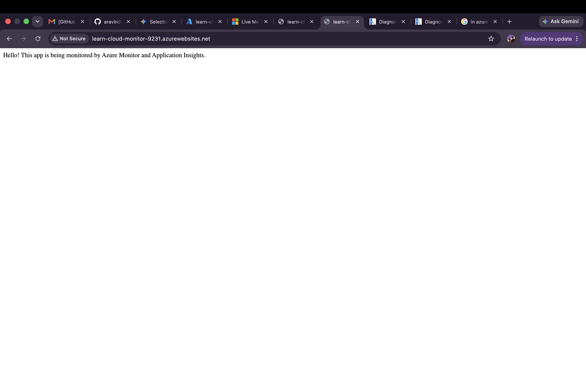
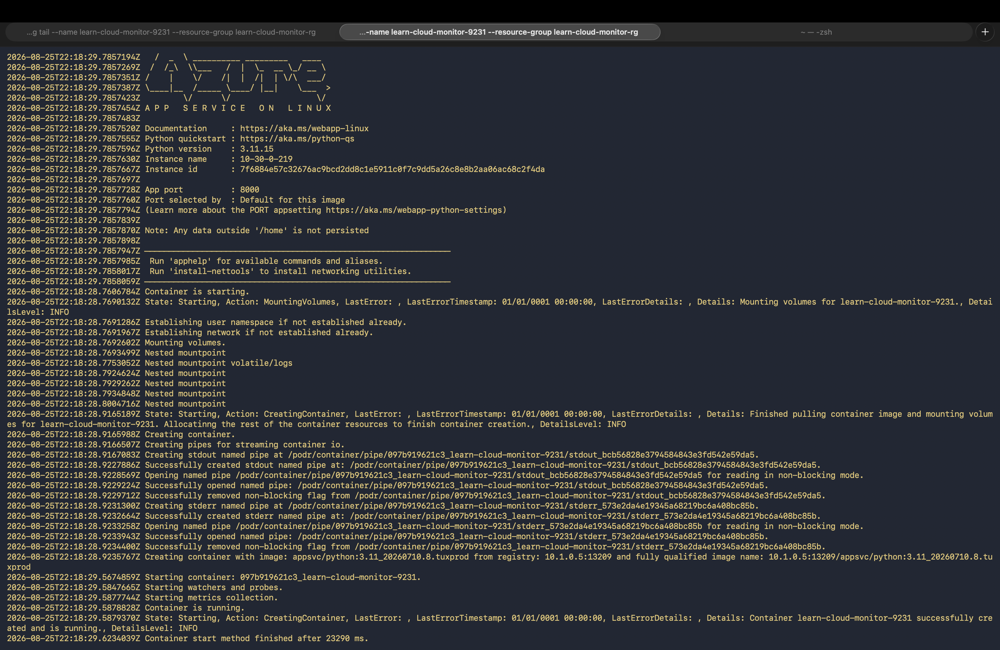
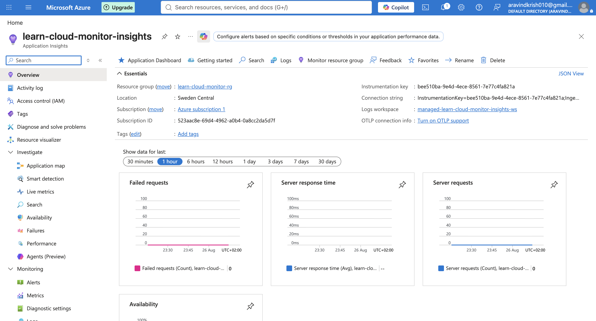

# Project 10: Azure Monitor + Application Insights for a Running Web App

## What this project set out to do
Configure Azure Monitor and Application Insights to observe a running Python Flask web app on Azure App Service — tracking requests, response times, and errors automatically.

## What was successfully built and verified
- Created an Application Insights resource, automatically backed by a Log Analytics workspace
- Connected it to a Flask web app via the `APPLICATIONINSIGHTS_CONNECTION_STRING` app setting
- Instrumented the app using Azure's modern `azure-monitor-opentelemetry` SDK (the officially recommended replacement for the older, deprecated `opencensus` libraries)
- Verified via live application logs that the monitoring SDK initialized successfully at runtime (confirmed with an explicit success/failure check in code, not just assumed)
- App deployed and ran correctly throughout, serving live HTTP requests with zero errors

## The unresolved issue — an honest account
Despite a fully correct setup (verified connection string, verified successful SDK initialization, verified live traffic to the app), **no telemetry data ever appeared in Application Insights' Logs, Overview, or Live Metrics.**

### What was ruled out through methodical debugging:
- ❌ Wrong Log Analytics table name (confirmed `requests` is correct; `AppRequests` doesn't exist in this schema)
- ❌ Corrupted or incorrect connection string (verified directly via CLI, byte-for-byte)
- ❌ Code crash or import failure (confirmed via live logs: `SUCCESS: Azure Monitor configured` printed on every startup)
- ❌ Missing dependencies (confirmed clean build with 0 errors/warnings in Oryx build
 logs)
- ❌ Billing/quota limits (Application Insights' free tier allows 5 GB/month of ingestion — nowhere near exceeded)
- ❌ Batching delay (tested with explicit force_flush() calls — no change)

### Working theory
The most likely explanation is a platform-level restriction on Azure App Service's Free (F1) tier — specifically around outbound telemetry delivery on shared, resource-constrained compute. An attempt to isolate this by temporarily testing on the paid Basic (B1) tier was blocked by an unrelated Azure regional capacity issue ("No available instances to satisfy this request"), so this theory remains unconfirmed but is the most consistent explanation given the evidence.

## Why this is still valuable, documented honestly
Real cloud engineering regularly involves configurations that are technically correct on paper but don't work due to platform quirks with no clear public documentation. The actual skill demonstrated here is the debugging methodology: forming a hypothesis, testing it directly (live log streaming, direct API verification, code-level self-diagnosis), ruling out causes systematically, and knowing when further debugging has diminishing returns relative to the value gained.

## Tools used
- Azure CLI
- Azure App Service (Free tier, briefly tested on Basic tier)
- Azure Application Insights + Log Analytics
- Python 3.11 + Flask
- azure-monitor-opentelemetry SDK

## Proof of work
**Live app running successfully:**

**SDK confirming successful monitoring configuration at runtime:**

**Application Insights resource, correctly provisioned:**

## Cost note
Briefly tested Basic (B1) tier for under 2 minutes before reverting to Free (F1) — negligible cost. All resources torn down after project completion.
